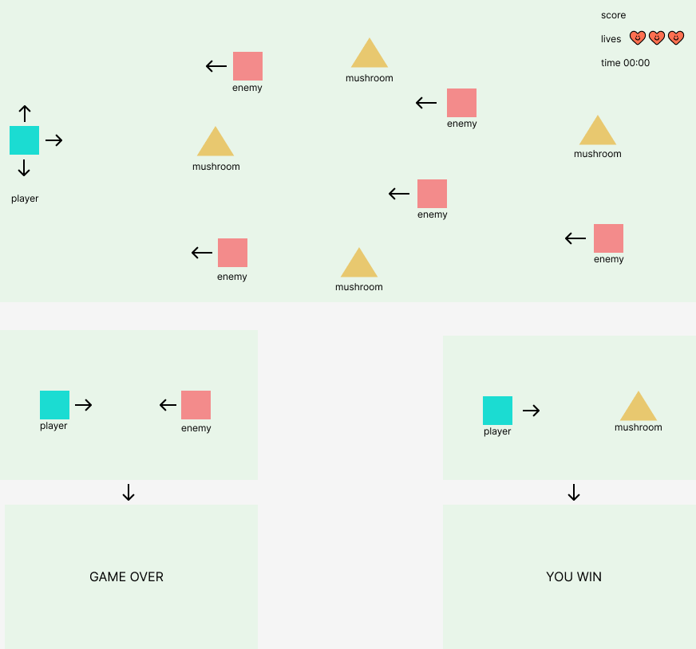

# Fungi Finder 

## Eres un aventurado recolector de setas se adentra a un bosque para encontrar las setas mas raras. Cuidado! Tienes que evitar encontrarte con las peligrosas criaturas del bosque.

# Planificación 

1. Funcionalidad del juego: Recolecta la mayor cantidad de setas que puedas antes de que el tiempo se acabe. Si chocas contra un enemigo perderas una vida. 

2. Diseño del juego (low-fi): Creado con figma falta subirlo al README.

3. Lista de tareas:
Especificar todos los archivos que tendra el juego, y crear el area de juego. 

4. Organización de OOP:
- Clases: Logica, Gamearea, Player, Enemies, Fungi
- Métodos: Enemyattack();
- Atributos
5. Empezar a crear tu juego.

# Recomendaciones 
- Usar chat GPT para planificar y organizar el juego. 
- Usar Trello para planificar tareas.
- Crea una rama para cada tarea. 

# Recordar que hay que hacer dos commits por día!